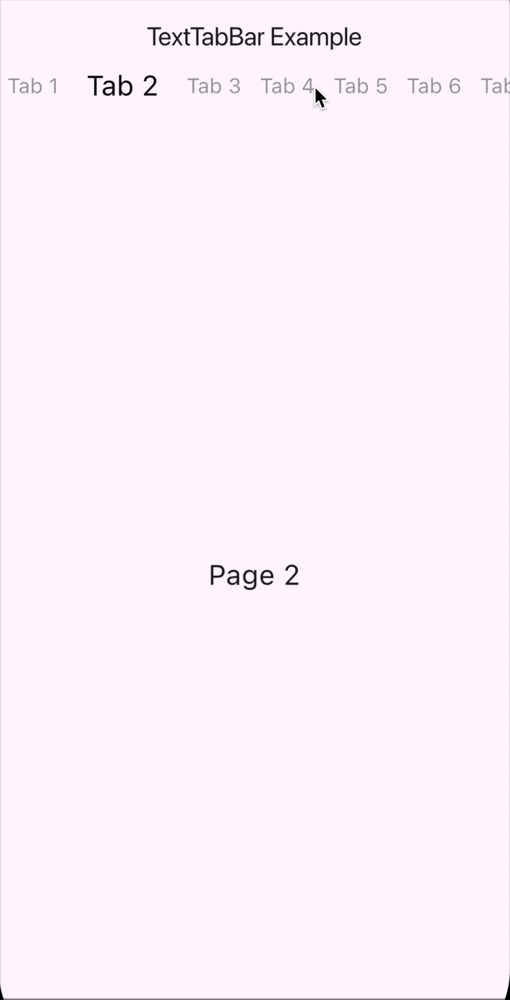

# TextTabBar

TextTabBar is an open-source Flutter package that provides a customizable tabbar where each element is an animated text. This will allow you to use a minimalistic and agreeable tab bar for your users.

## Features

* :iphone: The behavior completely copies the behavior of the native tabbar;
* :art: Fully customizable styles for elements;
* :airplane: Various and smooth transition animations;
* :shell: Simple and easy to use configuration.

## Getting started

To use TextTabBar in your Flutter project, follow these steps:

1. Add the dependency to your `pubspec.yaml` file:

```yaml
dependencies:
  flutter:
    sdk: flutter
  text_tab_bar: ^0.0.1
```

2. Run `flutter pub get` to install the package.

## Usage

Import the package in your Dart file and customize the tab bar according to your needs:



```dart
DefaultTabController(
  length: ...,
  child: Builder(
    builder: (context) {
      final tabController = DefaultTabController.of(context);
      return Column(
        children: [
          TextTabBar(
            controller: tabController,
            tabs: ...
          ),
          Expanded(
            child: TabBarView(
              controller: tabController,
              children: ...
            ),
          ),
        ],
      );
    },
  ),
)
```

<br>

#### Сustomizable text styles

You can override the default text styles to one that suits you better, for example like this:


```dart
TextTabBar(
  ...,
  selectedTextStyle: TextStyle(
    color: Colors.red,
    fontSize: 24.0,
  ),
  unselectedTextStyle: TextStyle(
    color: Colors.green,
    fontSize: 18.0,
  ),
)
```

<br>
<br>
<br>
<br>
<br>
<br>
<br>
<br>
<br>
<br>

#### Floating animation

You can use a floating animation that will look like a wave, flowing from one element to another:


```dart
TextTabBar(
  ...,
  isFloatingAnimation: true,
)
```

<br>
<br>
<br>
<br>
<br>
<br>
<br>
<br>
<br>
<br>
<br>
<br>
<br>
<br>
<br>

## License

This package is licensed under the MIT License. For more information, see the [LICENSE.md]([https://github.com/Filastian/text_tab_bar/blob/develop/LICENSE]) file.

## Additional information

For more information, visit the [TextTabBar GitHub repository](https://github.com/Filastian/text_tab_bar).
